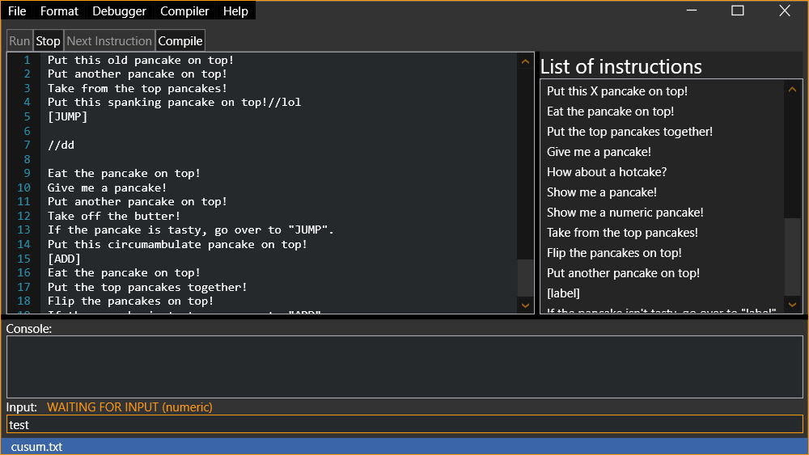
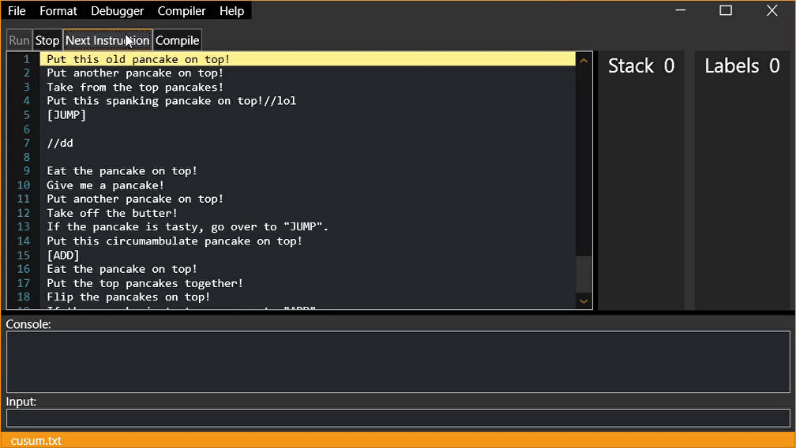

# Pancake Stack Net
**Pancake Stack Net** is an integrated development environment for the [Pancake Stack](https://esolangs.org/wiki/Pancake_Stack) esoteric programming language.

This software allows you to write, debug and compile programs.

## Getting Started
### Prerequisites
- .NET Framework (>= v4.7.2)

### How to run
Compiled version:
1. Download the latest release (on the right side)
2. Extract Executable.zip
3. Double-click on IDE.exe

From source:
1. Clone the repository
2. Open PancakeStack_NET.sln in Visual Studio
3. Build the solution (Ctrl+Shift+B)

## Screenshots of IDE
### Continuous debugging

### Debugging step by step

## Syntax
The pancake stack starts out as empty.
| Code | Meaning|
|---|---|
| Put this X pancake on top! | Push the word length of X on top of the stack, i.e. "wonderful" would push 9.|
| Eat the pancake on top! | Pop the top value off of the stack, and discard it.|
| Put the top pancakes together! | Pop off the top two values, add them, and push the result.|
| Give me a pancake! | Input a number value and push it on the stack.|
| How about a hotcake? | Input an ASCII character and push its value on the stack.|
| Show me a pancake! | Output the top value on the stack as an ASCII character, but don't pop it.|
| Take from the top pancakes! | Pop off the top two values, subtract the second one from the first one, and push the result.|
| Flip the pancakes on top! | Pop off the top two values, swap them, and push them back.|
| Put another pancake on top! | Pop off the top value and push it twice.|
| [label] | Defines a label to go back to (Can also define a comment, if needed). When you go back to the label, it goes to the line number (1 indexed) of the top value of the stack when the label was defined.|
| If the pancake isn't tasty, go over to "label". | Go to label [label] if the top value is 0. |
| If the pancake is tasty, go over to "label". | Same as above, except go if the top value is <i>not</i> 0.|
| Put syrup on the pancakes! | Increment all stack values.|
| Put butter on the pancakes! | Increment only the top stack value.|
| Take off the syrup! | Decrement all stack values.|
| Take off the butter! | Decrement only the top stack value.|
| Eat all of the pancakes! | Terminate the program.|

### New instruction
In addition to the language specification, here is an additional instruction:
| Code | Meaning|
|---|---|
| Show me a numeric pancake! | Output the top value on the stack as a number, but don't pop it.|

The instruction does not appear in the "specification", but I think adding it here was necessary.

Instruction adds a newline character when called, regardless of the "-nonewline" flag in the debugger or compiler.

## Examples
The repository contains 3 source codes of example programs:
- shimakaze.psc Prints Hello Worl... Prints Shimakaze-Kan
- cusum.txt Takes the number n from the user, sums the numbers from 0..n and returns the result.
- cat_improved.txt This is a revised version of the CAT program from the esolang wiki that takes input from the user and displays it. Unlike the original, it accepts all ASCII characters and the input can be of any length. This is possible because the input is stored in the console input buffer, and then the next character is fetched in each iteration. The program terminates when it encounters the character '0'.

## Project implementation information
- Written in C#
- Using Windows Presentation Foundation
- Following the MVVM pattern
- For .NET Framework 4.7.2

## How to Use
To learn how to use the IDE and compiler, check out the [repository wiki](https://github.com/Shimakaze-Kan/Pancake-Stack-Net/wiki).

## License
This project is licensed under the [MS-PL License](https://opensource.org/licenses/MS-PL)
